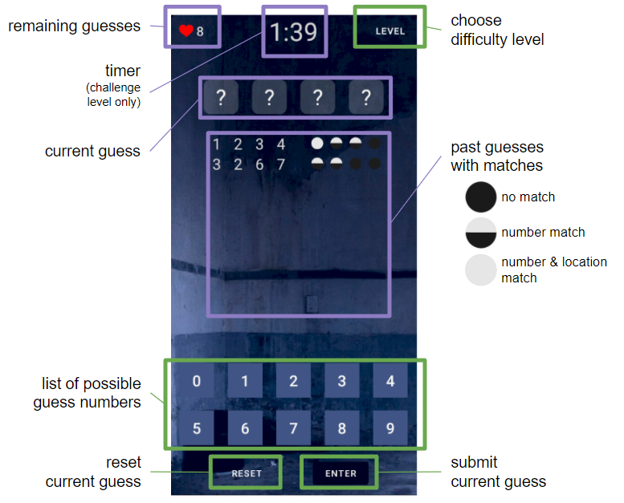

# Mastermind

## Table of Contents
1. [Overview](#Overview)
2. [Development](#Development)
3. [Running Mastermind](#Run)
4. [Playing Mastermind](#Play)

## Overview 
### Description
An Android mobile application based on the code breaking board game Mastermind. 

*You wake up. Trapped in a cursed mansion. The only way to escape is to figure out the secret code. 
 Do you have what it takes to **crack the code** and escape the cursed mansion?*

### Walkthrough 

## Development 
### Brainstorm
* Brainstorm

### Wireframe

### Planning
* Plan

### Building & Debugging
* Build

### Creative Extensions
#### Implemented
* Create haunting and tense atmosphere through background, color scheme, and music
* Build option to choose difficulty level: easy, normal, challenge
* Build timer for challenge level to increase difficulty and tension
* Add haunting background music for easy and normal levels
* Add tense background music that intensifies as time runs out for challenge level

#### Attempted
* Data persistence on orientation change (will continue working on in future)

#### Future Implementations
* Menu screen with option to start game or view rules
* Rules screen explaining rules of the game and user interface guide
* Continue testing user interface with various devices (ex. tablet, iOS devices)

## Running Mastermind 
### How to Run Code
* Download Android Studio: https://developer.android.com/studio
* Download this Mastermind repository from GitHub
* Open repository on Android Studio with minSDK 21 or above
* Create virtual mobile device (ex. Pixel 3a API 30)
* Run and install application on virtual device 

### How to Run on Mobile Device
* Download Mastermind.apk on mobile device: 
   https://drive.google.com/file/d/1oxS7ogRBJMdFFZulqrvkCfko0vlO4KSY/view?usp=sharing
* Locate Mastermind.apk (in downloads or where downloads are stored)
* Install Mastermind.apk 

## Playing Mastermind 
### How to Play
* Objective: *crack the secret code and escape the cursed mansion*
* Make sure device has sound on
* Open Mastermind application
* Guess a 4 digit code with the possible numbers provided
* Submit guess to check matches
* Analyze past guesses and matches (see UI guide below for match guide) to crack the code
* Submit the correct code to escape before guesses or time runs out!

### UI Guide

