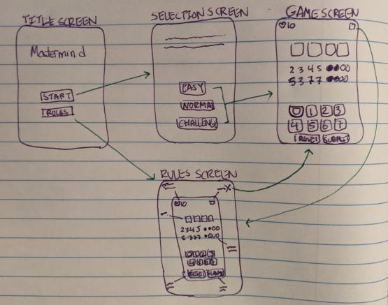

# Mastermind

## Table of Contents
1. [Overview](#Overview)
2. [Development](#Development)
3. [Running Mastermind](#Run)
4. [Playing Mastermind](#Play)

## Overview 
### Description
An Android mobile application based on the code breaking board game Mastermind. 

*You wake up. Trapped in a cursed mansion. The only way to escape is to figure out the secret code. 
 Do you have what it takes to **crack the code** and escape the cursed mansion?*

### Walkthrough 

## Development 
### Understand Expectations
Before beginning the development process, I wanted to understand all expected details of the product. I analyzed the implementation guide carefully and noted deadlines, requirements, and optional implementations. I consolidated a list of concepts I was unfamiliar with, such as Integer Generator API, and another list of concepts I am familiar with that may be needed for product development. I also determined any unclear expectations that need further clarification.

* Need to Research
  * Mastermind gameplay and UI design
  * dynamic view creation (ex. buttons)
  * pop up dialog
* Fammiliar Concepts
  * AsyncHTTPClient for API
  * design and develop interactive UI
  * develop game (ex. Connect Four)
* Unclear Expectations 
  * If secret code is "1234" and guess is "1156", would user guess have a location match for the first "1" and a value match for the second "1"? Or would it only take either the location match or value match? 
  * If secret code is "1234" and guess is "2222", would match priority be based on location or which match comes first?

### Research
During my research on Mastermind itself, I evaluated how the traditional gameplay matches the expected implementation. I also deducted temporary answers based on rules from the traditional gameplay to the unclear expectations found in the implementation guide. Although I had temporary answers, I noted that it still needs to be clarified with the project manager or team lead to avoid miscommunication during a team production.

I also explored development concepts I was unfamiliar with, such as creating a pop up window and building dynamic views, and how to make the game more accessible for individuals with disabilities. I investigated which colors were differentiable for people with colorblindness as well as button placements for those who may have physically impairments.

* Research
  * Mastermind gameplay 
  * Mastermind UI design as board games, PC games, mobile games
  * dynamic view creation (ex. buttons)
  * pop up dialog
  * accessibility (ex. color blindness, physical impairment)
 
### Brainstorm
* Product Design
  * Escape room like theme (ex. cursed mansion) to create immersive, interactive twist on a classic game
  * Add suspenseful background music and timer to add to mysterious atmosphere
  * Dynamic buttons to allow scaliblity when developing multiple levels: easy, normal, challenge
  * Title screen, selection screen, rules screen, game screen, level menu, game end popup dialog
* Accessibility
  * High contrast colors, intentional color pairings (ex. green + purple) -> increase accessibility for those with color blindness
  * Use shapes and words to differentiate objects -> increase accessibility for those with color blindness
  * Larger text -> increase accessibility for those with visual impairment
  * Buttons for easier navigation by voice control -> increase accessibility for those with physical impairment
  * Larger buttons at bottom of screen -> increase accessibility for those with physical impairment

### Wireframe Sketch

### Planning & Building
While keeping the deadline in mind, I analyzed which features would impact users the most. The most impactful features became a priority to implement. Next, I broke down the features into smaller goals. To meet all the goals, I organized and scheduled achievable goals for each day until the deadline. I also planned to finish 1-2 days early to accommodate for delays during development.

   | Day  | To-Do                                                  |
   | ---- | ------------------------------------------------------ |
   | 1    | create game screen UI, implement Integer Generator API |
   | 2    | build dynamic buttons, develop game algorithm          |
   | 3    | develop game algorithm, create PastGuess class         |
   | 4    | bind PastGuess to recyler view, add levels menu        |
   | 5    | create levels, add background and icons                |
   | 6    | add music, test, debug                                 |
   | 7    | readme, debug                                          |

While building, I developed small scale implementations of each feature while keeping scalibility in mind. For example, I developed and tested the game with a secret code of length two with only 1 and 2 as possible numbers. Since I wanted to make sure it is scalable, I implemented dynamic button creation for more challenging levels with larger number variety. This allowed me to develop and debug the code faster. 

### Debugging & Testing
After completing parts of a feature, I ran and debuged the program to make sure that the application worked. This was done consistently throughout the development process. After completing a feature, I tested the feature keeping in mind edge cases and different situations the user might be in. For example, I tested how accurately the application matched user guess and secret code by inputting unfilled guesses, partly filled guesses, no matches, all matches, repeated numbers in guess (ex. comparing "1234" while guess is "2222"). Going forward, I will continue to fix issues regarding data persistence during application pause and orientation change as well and accommodate for devices of different sizes.

### Creative Extensions
* Implemented
  * Create haunting and tense atmosphere through background, color scheme, and music
  * Build option to choose difficulty level: easy, normal, challenge
  * Build timer for challenge level to increase difficulty and tension
  * Add haunting background music for easy and normal levels
  * Add tense background music that intensifies as time runs out for challenge level
* Attempted
  * Data persistence on orientation change (will continue working on in future)

### Future Implementations
* Menu screen with option to start game or view rules
* Rules screen explaining rules of the game and user interface guide
* Continue testing user interface with various devices (ex. tablet, iOS devices)

## Running Mastermind 
### How to Run Code
* Download Android Studio: https://developer.android.com/studio
* Download this Mastermind repository from GitHub
* Open repository on Android Studio with minSDK 21 or above
* Create virtual mobile device (ex. Pixel 3a API 30)
* Run and install application on virtual device 

### How to Run on Mobile Device
* Download Mastermind.apk on mobile device: 
   https://drive.google.com/file/d/1o2q29E7yBUi3rLXdZKwuDAstzKgI9-Bq/view?usp=sharing
* Locate Mastermind.apk (in downloads or where downloads are stored)
* Install Mastermind.apk 

## Playing Mastermind 
### How to Play
* Objective: *crack the secret code and escape the cursed mansion*
* Make sure device has sound on
* Open Mastermind application
* Guess a 4 digit code with the possible numbers provided
* Submit guess to check matches
* Analyze past guesses and matches (see UI guide below for match guide) to crack the code
* Submit the correct code to escape before guesses or time runs out!

### UI Guide

https://unsplash.com/photos/_u3rMKylNdQ

## Resources
* Background by <a href="https://unsplash.com/photos/_u3rMKylNdQ">Yener Ozturk</a>
* "Caves of Dawn" by <a href="https://pixabay.com/music/ambient-caves-of-dawn-10376/">GuilhermeBernardes</a>
* "Dead-By-Daylight" by <a href="https://pixabay.com/music/build-up-scenes-dead-by-daylight-10243/">TommyMutiu</a>
